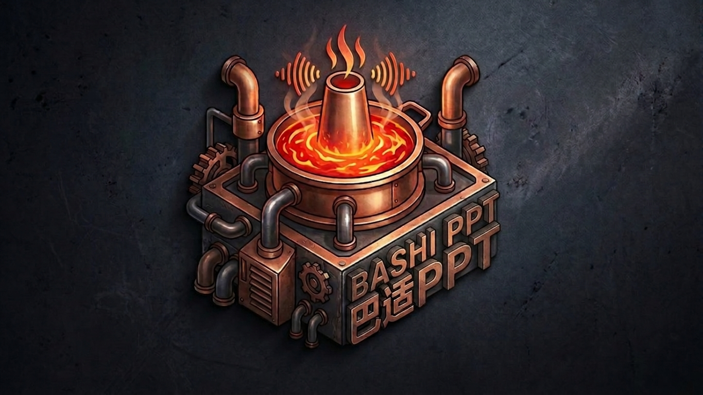

<div align="center">
  

  # 巴适PPT

  **面向教师备课、逐页讲稿与可编辑课件的 AI 助手**

  [English](README.md) · [使用指南](docs/USER_GUIDE_CN.md) · [隐私说明](docs/PRIVACY_CN.md) · [下载发行版](https://github.com/gtree965/bashi-ppt/releases)
</div>

> 巴适PPT不参与“一句话生成整套幻灯片”的功能竞赛。它更关心教师是否能看懂、确认、修改并真正带进课堂。

## 为什么做巴适PPT？

许多 AI PPT 工具把重点放在“从提示词到成品有多快”。巴适PPT选择另一条路：

1. 先理解和审阅材料；
2. 由用户确认内容边界；
3. 在导出前编辑大纲；
4. 保留原生可编辑的文字、图片和图示；
5. 把逐页讲稿写入 PowerPoint 备注区。

首要服务对象是使用中文或中英混合材料备课的教师。产品仍处于 `v0.1.0` 共创试用阶段。

## 两条备课路径

### 教学创作模式

适合只有主题，或允许补充教学背景、例子和课堂提问的场景。可以获得：

- 根据主题或材料范围推荐的页数；
- 可修改的大纲；
- 可导出为 Markdown、DOCX、ODT 的备课文章；
- 可选择讲课时长和风格的逐页讲稿；
- 原生可编辑的 `.pptx` 文件，而不是整页图片。

### 严格依据材料模式

适合课程通知、规章制度、指定文章或内容边界必须保持稳定的材料：

- 先从材料中提取事实表；
- 用户可以修改、删除并确认事实；
- 每页标注使用了哪些已确认事实；
- 实时检查遗漏编号、无效编号和无事实依据的内容页；
- 页数不符时只允许合并或拆分，不会为了凑页数静默删事实或编造内容。

这里的审计检查的是“事实编号的结构覆盖”，不等于系统已经证明正文语义绝对正确。最终内容仍应由教师审阅。

## 赞美诗投影工具

赞美诗歌词模式不依赖大模型，支持：

- 单语和双语歌词；
- 适合投影的深色主题；
- 分页预览和每页行数调整；
- 简繁体转换；
- 可选标题页和阿们页。

## 主要功能

- 支持 LM Studio、Ollama 等本地 OpenAI 兼容接口
- 可选 OpenRouter 或其他 OpenAI 兼容云端服务
- 教学创作与严格依据材料两种模式
- 用户确认事实表与实时结构审计
- 可编辑大纲、逐页讲稿、图示、图片和 PPTX 元素
- 根据主题或参考材料自动推荐页数
- 支持简体中文、英文和中英双语输出
- 支持中文、英文及中英混合输入
- 讲稿写入 PowerPoint 备注区
- 备课文章可导出 Markdown、DOCX、ODT
- 可选 Pixabay 图片搜索
- Flask 本地服务预构建前端，无需安装 Node.js
- 独立的赞美诗歌词投影工作流

## 下载

请从 GitHub Releases 下载最新版：

**https://github.com/gtree965/bashi-ppt/releases**

Windows 便携包已经包含 Python 和所需 Python 库，不需要另装 Python 或 Node.js。

## Windows 便携版快速开始

1. 下载 `Bashi-PPT-v0.1.0-Windows-Portable.zip`。
2. 将压缩包完整解压到普通、可写入的文件夹。
3. 双击 `run_portable.bat`。
4. 浏览器打开 `http://localhost:5100`。
5. 点击右上角齿轮，配置本地或云端模型。

不要直接在 ZIP 压缩包内部运行程序。

## AI 模型选择

### 本地模型

- **LM Studio**：默认地址 `http://localhost:1234/v1`
- **Ollama**：默认地址 `http://localhost:11434/v1`

本地模式可以让备课内容留在电脑内，但速度和质量会受到内存、显存、模型大小和量化方式影响。普通集成显卡笔记本不适合运行大型模型。

### 云端模型

设置界面可以直接配置 OpenRouter。其他 OpenAI 兼容服务可在 `.env` 中设置：

```env
LLM_BASE_URL=https://你的服务地址/v1
LLM_API_KEY=你的API密钥
LLM_MODEL=模型ID
```

使用云端模型时，提示词、参考材料、大纲和讲稿请求会发送给相应服务商。使用敏感材料前，请自行确认服务商的数据保留政策、服务地区、费用和法律责任。

详见：[隐私与数据去向](docs/PRIVACY_CN.md)。

## 手动安装

手动安装适用于 macOS、Linux、开发环境，或希望使用系统 Python 的用户。

要求：

- Python 3.10 或更高版本
- 首次安装依赖时需要联网
- AI 工作流需要一个 OpenAI 兼容模型接口

```bash
git clone https://github.com/gtree965/bashi-ppt.git
cd bashi-ppt
python -m venv venv
```

Windows：

```bat
venv\Scripts\activate
python -m pip install -r backend\requirements.txt
copy .env.example .env
python backend\app.py
```

macOS / Linux：

```bash
source venv/bin/activate
python -m pip install -r backend/requirements.txt
cp .env.example .env
python backend/app.py
```

仓库已包含生产前端。只有修改前端源码时才需要 Node.js。

## 当前支持边界

- 优先目标：Windows + PowerPoint / WPS Office
- 代码运行：Windows、macOS、Linux
- macOS/Linux 安装包：`v0.1.0` 暂采用 Python 手动安装
- 正式输入范围：中文、英文、中英混合
- 正式输出范围：简体中文、英文、中英双语
- 其他语言：实验性支持
- Keynote、LibreOffice 对 PPTX 的部分布局和备注支持可能不同

## 开发与测试

后端：

```bash
python -m unittest discover -s tests
python backend/app.py
```

前端：

```bash
cd frontend
npm install
npm run lint
npm run test:grounding-audit
npm run dev
```

## 文档

- [中文使用指南](docs/USER_GUIDE_CN.md)
- [English User Guide](docs/USER_GUIDE.md)
- [隐私与数据去向](docs/PRIVACY_CN.md)
- [Privacy and Data Flow](docs/PRIVACY.md)
- [v0.1.0 发布说明](docs/RELEASE_NOTES_v0.1.0.md)
- [参与贡献](CONTRIBUTING.md)
- [安全政策](SECURITY.md)

## 许可证

巴适PPT采用 [MIT License](LICENSE) 开源。

## 作者

Alex Li · ncorecpu@gmail.com
